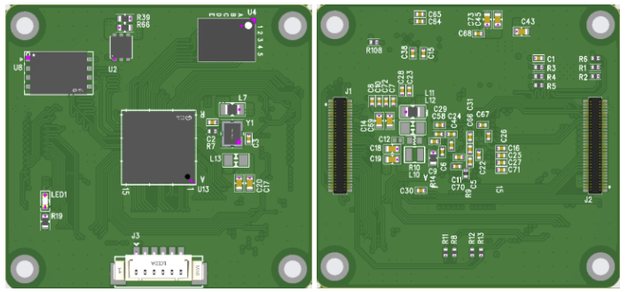

# STM32H7S7-SOM

커넥터: DF40C-60DP-0.4V(51)  Hirose Electric Co Ltd
 - 상대 커넥터: DF40C-60DS-0.4V(51)

PCB 레이어: 6층

보드 크기: 71x70 mm

### 스펙
- MCU: STM32H7S7I8K6
- OSPI PSRAM: APS256XXN-OB9-BG (32MB)
- QSPI FLASH: W25Q256JVEIQ (32MB)